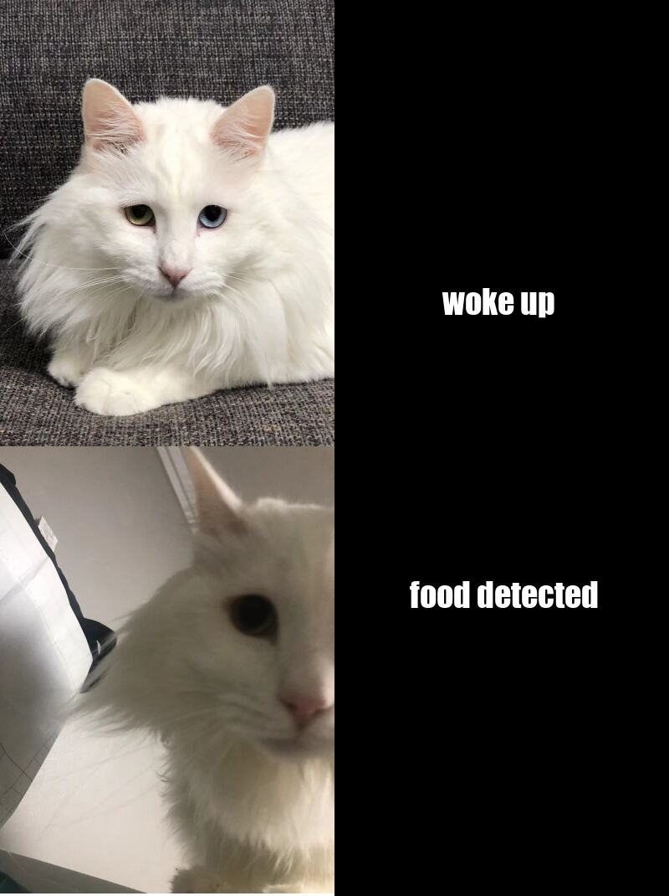

```{r setup, include=FALSE}
knitr::opts_chunk$set(echo = TRUE, message = FALSE)
```

```{css}
body {
  color: #333333;
  line-height: 1.5;
}

h1,h2{
  color: #666666;
  font-weight: bold;
  margin-top: 1em;
```{css}


##My meme

Here is a meme picturte I created, the content is originally from a post i saw asking what is the best days of your life,and someone said this which I feel the same, and I used a suitable picture to make this thought a meme 
pic :)

```

```

```{r file='meme.R', eval=FALSE}

```


##My animated GIF

Here is a animated GIF I created, it has a loop of 4 frames of pictures, picture changes when it comes to the next frame. The content is some scenes from one of my favorite video game "Disco Elysium"


```{r file='animation.R', eval=FALSE}

```


